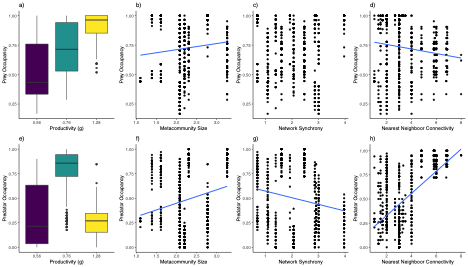
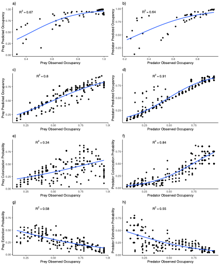

# Synthesis_Spatial_Protist

Title: Synthesizing the Effects of Spatial Network Structure on Predator Prey Dynamics

Authors: Matthew D. Green, Clara Woodie, Megan Whitesell, Sean Hayes, and Kurt E. Anderson

Status of MS: Submitted Frontiers in Ecology and Evolution

# Methods

### Figure 1: Experimental Networks

# Results

### Figure 2: Occupancy Dynamcis of Predators and Prey

### Figure 6: Colonization and Extinction Dynamics of Predator and Prey Occupancy

