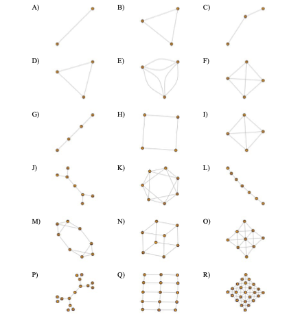

# Synthesis_Spatial_Protist
Data synthesis effort to understand spatial effects on predator-prey dynamics

Title: Synthesizing the Effects of Spatial Network Structure on Predator Prey Dynamics

Authors: Matthew D. Green, Clara Woodie, Megan Whitesell, Sean Hayes, and Kurt E. Anderson

## Experimental Networks

