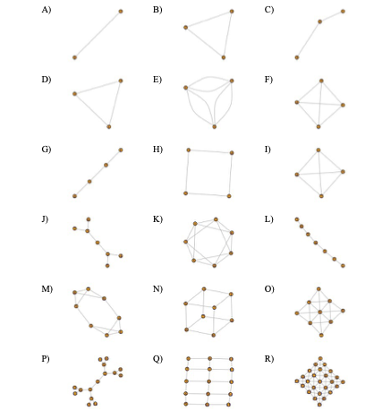
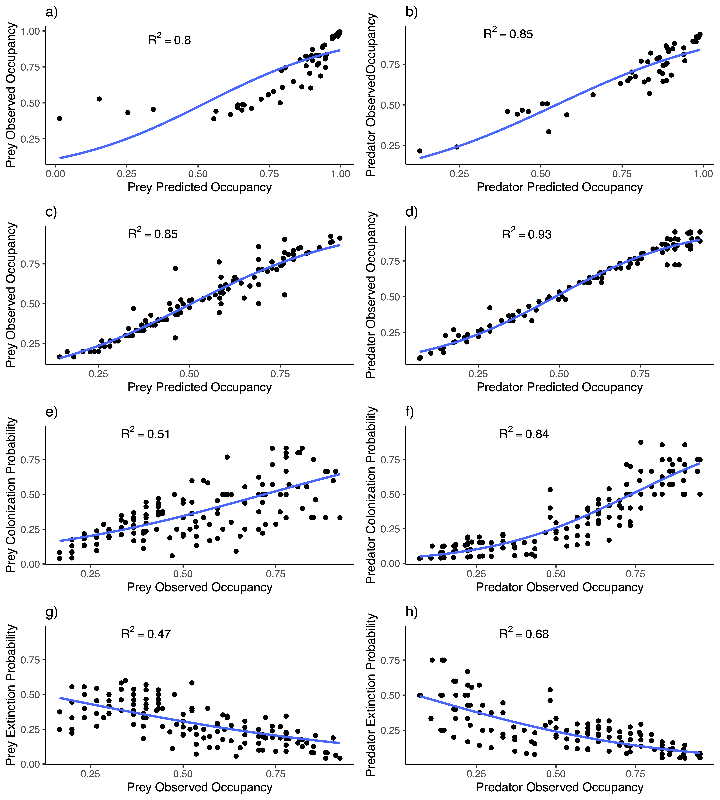
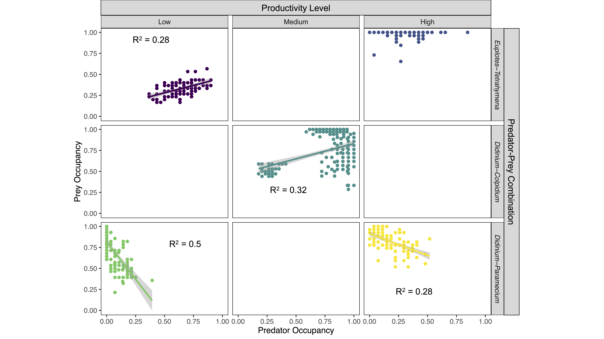
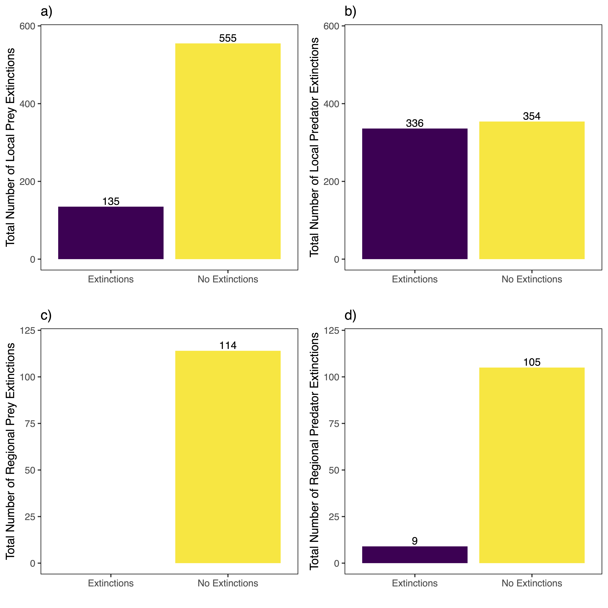

# Synthesis_Spatial_Protist

**Title:** Synthesizing the Effects of Spatial Network Structure on Predator Prey Dynamics

**Authors:** Matthew D. Green, Clara Woodie, Megan Whitesell, Sean Hayes, and Kurt E. Anderson

**Status of MS:** Submitted to Frontiers in Ecology and Evolution

**Source data:**
- https://datadryad.org/stash/dataset/doi:10.5061/dryad.3j9kd51kx
- http://datadryad.org/stash/dataset/doi:10.5061/dryad.sc1pq
- http://datadryad.org/stash/dataset/doi:10.5061/dryad.p1n86

This project analyzes protist microcosm experiments (predator-prey occupancy, extinction,
colonization) across metacommunities of varying spatial network structure, size, and
productivity. Scripts must be run in numeric order (`s0` → `s6`); later scripts depend on
objects created by earlier ones.

---

## Methods

### Figure 1: Experimental Networks

*Generated by `s1_plot_struct_syn.R` — see Figures table below for full script mapping.*

## Results

### Figure 2: Occupancy Dynamics of Predators and Prey

### Figure 6: Colonization and Extinction Dynamics of Predator and Prey Occupancy

### Figure 7: Bottom-up and Top-down Effects

### Supplementary Figures

#### Figure S1

---

## Script Order & Dependencies

| Script | Depends on | Creates |
|---|---|---|
| `s0_load_data.R` | raw CSV | `Data`, `reg.all`, `reg.ext`, `loc.all` |
| `s1_plot_struct_syn.R` | none (standalone) | Figure 1 network diagrams, `synch.datas` |
| `s2_occupancy_analysis.R` | `newer_pa_datas`, `all_pa_dataz` (from s4/s5) | `occupnacy`, `Ext_col_data_network`, GLM model sets |
| `s3_tim2ext_analysis.R` | `loc.all`, `reg.all` (s0) | Time-to-extinction figures, GLM model sets |
| `s4_ext_col_analysis.R` | `Data`, `all_pa_dataz` (s5) | `Datazz`, `new_pa_datas`, `newer_pa_datas`, `Ext_col_data`, GLM model sets |
| `s5_predicted_occupancy.R` | `Data`, `occupnacy` (s2), `reg.all` (s0) | `all_pa_dataz`, `Ext_col_data`, `pred_Ext_col_data`, `pred_network`, beta-regression models |
| `s6_trophic_anaysis.R` | `loc.all` (s0) | Trophic-pair figures, subset GLMs |

**Note on run order in practice:** because `s2` and `s4` both reference `newer_pa_datas`/
`all_pa_dataz` which are technically built in `s4`/`s5`, and `s5` references `occupnacy`
(built in `s2`) and `reg.all` (built in `s0`), the practical run order that satisfies all
dependencies is: **`s0` → `s4` (through `newer_pa_datas`) → `s5` (through `all_pa_dataz`) →
`s2` → rest of `s5` → `s3` → `s6`**. Consider consolidating shared data-prep steps into a
single early script to avoid this circular dependency.

---

## Core Data Objects

### `Data` (s0)
The raw dataset (`upd.datas.all.csv`) with two added columns:
- `pred.prey.oc`: 1 if both predator and prey occupied same day, else 0
- `predator`: relabeled to `"Didinium"`/`"Euplotes"` (title case)

Key raw columns: `number.bottles`, `media`, `productivity`, `year`, `prey`, `predator`, `day`,
`bottle`, `structure`, `network.syn.lap`, `lambda_m`, `bottle.number`, `replicate`,
`connectivity`, `nghbr.connect`, `pred.density`, `prey.density`, `ln.pred`, `ln.prey`,
`pred.oc`, `prey.oc` (binary daily occupancy flags), plus per-species trait columns
(`Prey.growth.rate`, `Prey.K.cap`, `Pred.attack.rate`, etc.).

> ⚠️ **`bottle` vs `bottle.number`:** `bottle` (427 unique values) is *not* a stable bottle
> identifier across days — it appears to increment per sampling event/row. `bottle.number`
> (25 unique values) is the correct stable per-network bottle ID. Always build unique bottle
> IDs from `bottle.number`, never from `bottle`.

### `reg.all` (s0) — **Regional/network-level summary table**
One row per network (`newID` = `number.bottles_predator_...`), aggregated across all bottles
and sampling days (day 3–75, `number.bottles > 1`). Contains:
- `prey.oc`, `pred.oc`: mean daily occupancy across the network
- `prey.time.2.ext`, `pred.time.2.ext`: first day density hit zero
- `prey.persistence`, `pred.persistence`, `cv.prey`, `cv.pred`
- `reg.prey.ext`, `reg.pred.ext`: "Extinctions"/"No Extinctions" labels
- `log.number.bottles`, `log.network.syn.lap`, `log.total.vol` (log-transformed predictors)

### `reg.ext` (s0)
Slim lookup table: `newID`, `reg.prey.ext`, `reg.pred.ext` — joined into `loc.all` to tag
each bottle with its network's overall extinction status.

### `loc.all` (s0) — **Local/bottle-level summary table**
One row per bottle per network (`newBottleID`), aggregated across sampling days. Contains
per-bottle occupancy (`prey.oc`, `pred.oc` — now correctly averaged as *fraction of days
occupied*, not collapsed to 0/1), extinction timing, persistence, CV, and species trait means
(`prey.growth`, `pred.attack`, `prey.size`, etc.). Joined with `reg.ext` for network-level
extinction context. This is the main table used in `s3` and `s6`.

> **Recently fixed bug:** the `unite()` calls building `newID`/`newBottleID` used positional
> range syntax (`number.bottles:predator`) which silently swept in unintended columns
> (including `day`), fragmenting every bottle's time series into single-day groups and
> forcing `prey.oc`/`pred.oc` to collapse to 0/1 instead of true fractional occupancy.
> Fixed by using explicit column name vectors in `unite()`.

### `Datazz`, `new_pa_datas`, `newer_pa_datas` (s4, s5)
`Datazz`: `Data` with a `newID` built from `media:predator:bottle`, sorted by ID and year.
`new_pa_datas`/`newer_pa_datas`: add lagged occupancy columns (`pred.oc-1`, `prey.oc-1`) per
bottle via `lag()`, used to detect colonization/extinction transitions day-to-day.

### `occupnacy` (s2) — **Local occupancy + colonization/extinction rates, bottle level**
Built from `newer_pa_datas`, grouped by `structure, replicate, connectivity, bottle, newID`.
Computes counts/probabilities of occupied vs. unoccupied days for predator and prey
(`prey.oc`, `pred.oc`, `prey.occupany`, `pred.occupany`, etc.), joined with `all_pa_dataz`
for covariates (`log.number.bottles`, `nghbr.connect`, `productivity`, `predator`).

### `Ext_col_data_network` (s2) — **Network-level occupancy/extinction table**
Same logic as `occupnacy` but aggregated to the network (`structure, replicate`) level
instead of individual bottle.

### `Ext_col_data` (s4, s5) — **Colonization/extinction transition table**
Built from `newer_pa_datas`'s lagged occupancy columns. For each bottle (`newID`), computes:
- `colonization_col_pred/prey`, `extinction_col_pred/prey` (binary per-day transition flags)
- Summed into `colonization_sum_*`, `extinction_sum_*`, and their "potential" denominators
- `colonization_prob_pred/prey`, `extinction_prob_pred/prey` (transition probabilities)
- `ext_colon_ratio_pred/prey` (extinction:colonization ratio)
- `pred.prey.oc`, `pred.pred.oc`: **predicted equilibrium occupancy** from colonization/
  extinction rates (Levins-style metapopulation prediction)

Two versions exist (in `s4` and `s5`) with slightly different day filters and downstream use.

### `all_pa_dataz` (s5)
Bottle-level lookup of observed mean occupancy (`prey.occupancy`, `pred.occupancy`) plus all
covariates (network structure, productivity, connectivity, species traits), keyed by `newID`.
Used to join covariates onto `Ext_col_data`.

### `pred_Ext_col_data` (s5) — **Local-scale predicted-vs-observed occupancy table**
`Ext_col_data` joined with `occupnacy`, filtered to interior values (0 < x < 1) for all
occupancy/probability columns. Used to test how well colonization/extinction-rate-based
*predicted* occupancy (`pred.prey.oc`, `pred.pred.oc`) matches *observed* occupancy
(`prey.oc`, `pred.oc`).

### `pred_network` (s5) — **Network-scale predicted-vs-observed occupancy table**
Analogous to `pred_Ext_col_data` but at the network level. Built from `newer_pa_datas`,
computes colonization/extinction probabilities per network, derives predicted occupancy
using `lambda_m` (a network-specific parameter), and `full_join`s with `reg.all`.

### `loc.all.plot`, `did_para_high/low`, `did_colp_med`, `eup_tetra_high/low` (s6)
Relabeled/filtered subsets of `loc.all` split by predator-prey pair
(`Euplotes-Tetrahymena`, `Didinium-Colpidium`, `Didinium-Paramecium`) and productivity level
(Low/Medium/High), used for pairwise predator-prey occupancy correlation analysis.

---

## Figures

> ⚠️ **Numbering mismatch:** the figure numbers in code comments (`#Figure 4`, `#Figure 5`,
> `#Figure 6`, `#Figure 8`, etc.) do not match the current manuscript numbering shown above
> (Fig. 1, 2, 6, 7, S1). The scripts likely predate a manuscript renumbering/restructuring.
> The table below lists both the **in-code comment label** and **content**, so you can map
> each block to whichever figure number the current MS draft actually assigns it.

| In-code label | Script | Content |
|---|---|---|
| "Figure 1" (networks) | `s1_plot_struct_syn.R` | Example network topologies (dendritic, lattice, stream, Holyoak/Sean/Fox structures) with synchrony ratios (largest/second-largest Laplacian eigenvalue) — likely current **Fig. 1** |
| *(untitled time series)* | `s0_load_data.R` | Raw predator/prey ln-density and occupancy over time by replicate/structure |
| *(untitled occupancy panels)* | `s2_occupancy_analysis.R` | Boxplots/scatterplots of prey/predator occupancy vs. productivity, predator identity, metacommunity size, neighbor connectivity — likely feeds current **Fig. 2** |
| "Figure 4" (Colonization) | `s4_ext_col_analysis.R` | Prey/predator colonization probability vs. productivity, predator identity, metacommunity size, connectivity |
| "Figure 5" (Extinction) | `s4_ext_col_analysis.R` | Same layout for extinction probability — colonization + extinction dynamics together likely correspond to current **Fig. 6** |
| *(untitled time-to-extinction)* | `s3_tim2ext_analysis.R` | Boxplots/scatterplots of local time-to-extinction vs. covariates |
| "Appendix S1 Figure 1" | `s3_tim2ext_analysis.R` | Bar counts of local vs. regional extinction events — likely current **Fig. S1** |
| "Figure 6" (Predicted vs. observed occupancy) | `s5_predicted_occupancy.R` | Local- and network-scale predicted occupancy (from colonization/extinction rates) vs. observed occupancy — likely relates to current **Fig. 7** (bottom-up/top-down effects) |
| "Figure 8" (Trophic pairs) | `s6_trophic_anaysis.R` | Prey occupancy vs. predator occupancy, faceted by predator-prey pair × productivity — likely relates to current **Fig. 7** |

Recommend re-checking each `plot_grid(...)` call against the actual submitted-MS figures and
updating the in-code `#Figure N` comments to match, so this table (and the code) stays
accurate going forward.

---

## Statistical Models

All GLM model-selection blocks follow the same pattern: a nested set of binomial (occupancy/
probability) or Poisson (count/time-to-event) GLMs with predictors `productivity`,
`log.number.bottles` (metacommunity size), `nghbr.connect`/`av.nghbr.connect` (neighbor
connectivity), and `predator` (identity), from single-predictor through the full additive
model (`mod0`–`mod14`) plus a null intercept-only model (`nullmod`). Models are compared via
**AICc weights** (`bbmle::AICtab`) and McFadden pseudo-R² (`(null.deviance - deviance) /
null.deviance`) is computed for every model in the set.

### `s2_occupancy_analysis.R`
1. **`aov(prey.oc ~ Local_volume)`** — prey occupancy by local bottle volume (32 vs 50 mL)
2. **Prey occupancy GLM set** (`occupnacy`, binomial): `mod0`–`mod14` + `nullmod`
3. **Predator occupancy GLM set** (`occupnacy`, binomial): `mod0`–`mod14` + `nullmod`
4. **Network-level prey occupancy GLM set** (`Ext_col_data_network`, binomial): `mod0`–`mod14` + `nullmod`
5. **Network-level predator occupancy GLM set** (`Ext_col_data_network`, binomial): `mod0`–`mod14` + `nullmod`

### `s3_tim2ext_analysis.R`
1. **`aov(prey.time.2.ext ~ Local_volume)`** — prey time-to-extinction by local volume
2. **Prey time-to-extinction GLM set** (`loc.all`, Poisson/log link): `mod0`–`mod15` (`mod15` adds `data_source`) + `nullmod`
3. **Predator time-to-extinction GLM set** (`loc.all`, Poisson/log link): `mod0`–`mod15` + `nullmod`

### `s4_ext_col_analysis.R`
1. **`aov()` × 4** — extinction/colonization probability (prey & predator) by local volume
2. **Prey colonization GLM set** (`Ext_col_data`, binomial): `mod0`–`mod14` + `nullmod`
3. **Predator colonization GLM set** (`Ext_col_data`, binomial): `mod0`–`mod14` + `nullmod`
4. **Prey extinction GLM set** (`Ext_col_data`, binomial): `mod0`–`mod14` + `nullmod`
5. **Predator extinction GLM set** (`Ext_col_data`, binomial): `mod0`–`mod14` + `nullmod`

### `s5_predicted_occupancy.R` — Predicted vs. observed occupancy (beta regression)
Local scale (`pred_Ext_col_data`, `betareg`, each vs. an intercept-only null, compared via AICc):
1. `prey.oc ~ pred.prey.oc` — observed vs. predicted prey occupancy
2. `pred.oc ~ pred.pred.oc` — observed vs. predicted predator occupancy
3. `colonization_prob_prey ~ prey.oc`
4. `colonization_prob_pred ~ pred.oc`
5. `extinction_prob_prey ~ prey.oc`
6. `extinction_prob_pred ~ pred.oc`

Network scale (`Ext_col_data_network_analysis`, `betareg`):
7. `pred.prey.oc ~ prey.oc`
8. `pred.pred.oc ~ pred.oc`

### `s6_trophic_anaysis.R` — Pairwise predator-prey occupancy correlation
For each of 5 predator-prey × productivity subsets (Didinium-Paramecium High/Low,
Didinium-Colpidium Medium, Euplotes-Tetrahymena High/Low), a binomial GLM of prey occupancy
against predator occupancy, each compared to an intercept-only null via AICc:
`glm(cbind(prey.sum.oc, sampling.days) ~ pred.oc, family = binomial)`

---

## Known Data-Quality Notes / Open Issues

1. **`bottle` column is not a stable bottle identifier** — use `bottle.number` for any
   grouping/uniting meant to represent "one physical bottle over time."
2. **Avoid positional `:` ranges in `unite()`/`select()`** (e.g. `number.bottles:predator`) —
   these depend on column order in `Data` and will silently include/exclude the wrong
   columns if the source CSV's column order ever changes. Use explicit `c(col1, col2, ...)`
   instead.
3. **`s2`, `s4`, `s5` have circular-looking dependencies** (`s2` needs objects from `s4`/`s5`
   and vice versa) — see run-order note above. Recommend refactoring shared data prep
   (`Datazz`, `new_pa_datas`, `newer_pa_datas`, `all_pa_dataz`) into `s0` or a dedicated
   shared-prep script to remove ambiguity.
4. **`raster::cv()`** is used for coefficient of variation; `raster` also masks `dplyr::select`,
   `dplyr::filter`, etc. — prefix with `dplyr::` where needed to avoid silent function-masking
   bugs after package updates.
